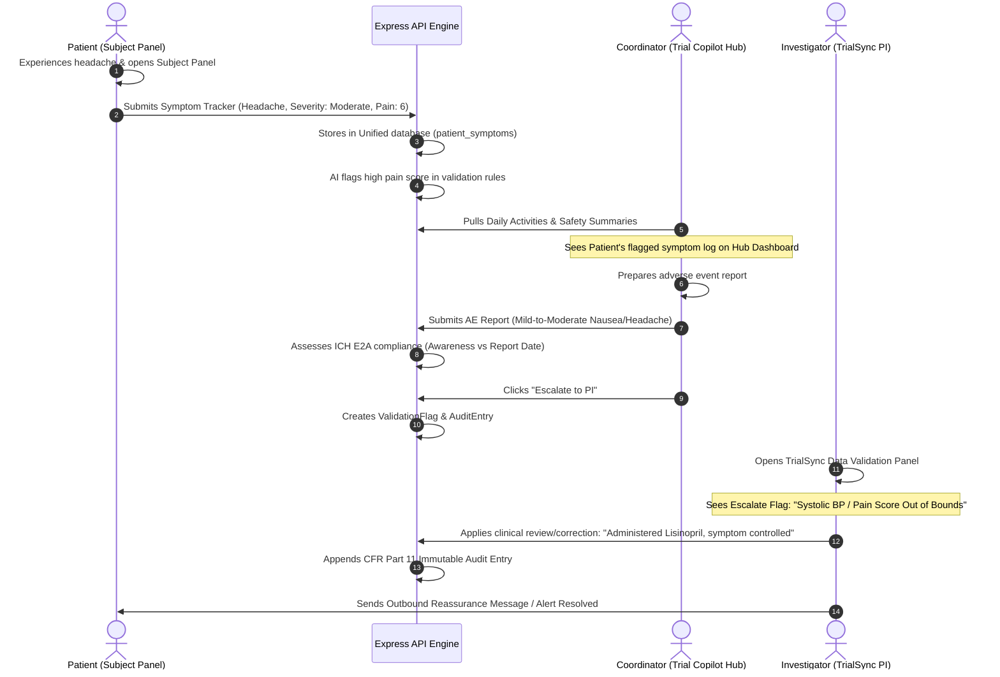
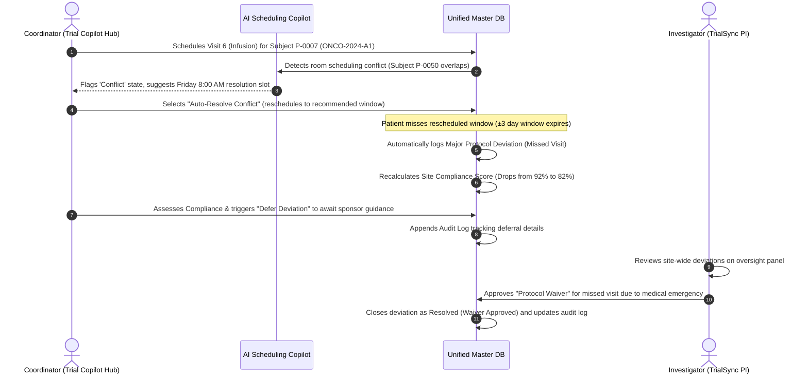
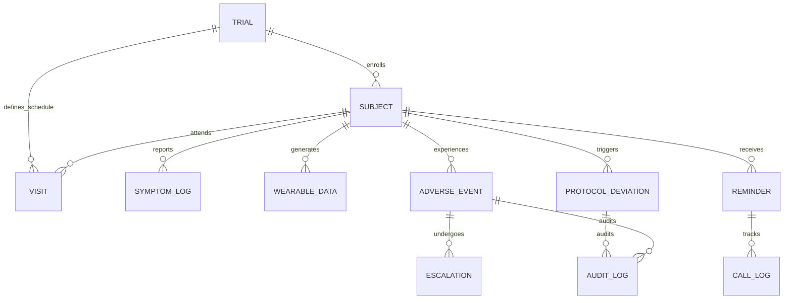

# Clinical Trial Oversight System: Comprehensive Architecture Analysis

This document provides a highly detailed, professional, and accessible breakdown of the **TrialSync Patient Trial Automation Platform**. It covers the significance of the three functional dashboards, maps out their integrated clinical data journeys, analyzes the architecture of a unified **Master Database (Master DB)**, explains the dynamic integration of **ClinicalTrials.gov (NCT Registry)**, and identifies existing technical gaps/bugs in the current implementation.

---

## 1. Functional Roles & Dashboard Significance

The platform is designed to automate and monitor clinical trial workflows. To serve a clinical trial effectively, the system divides responsibilities among three distinct user roles, each supported by a tailored frontend dashboard:

| Dashboard / Project | Target User | Operational Significance | Core Features |
| :--- | :--- | :--- | :--- |
| **Sponsor / Principal Investigator (PI) Panel**<br>`Trial_Sync` (Root Directory) | Principal Investigators (PIs), Clinical Sponsors, Medical Monitors, Biostatisticians | **High-Level Governance & Regulatory Compliance.** PIs are legally responsible for trial data integrity and patient safety. This dashboard provides macro insights and active data oversight. | • Aggregate multi-site enrollment metrics<br>• Central patient record directory<br>• **Data Validation Engine**: Flags data entry anomalies<br>• **Audit Trail**: CFR Part 11 compliant logs of data adjustments<br>• Predictive dropout and compliance analytics |
| **Trial Copilot Hub**<br>`trial-copilot-hub` (Sub-project) | Clinical Research Coordinators (CRCs), Site Nurses, Site Investigators | **Daily Site Operations & Administrative Execution.** Site staff manage physical and virtual patient interactions. The hub acts as a digital copilot to prevent protocol deviations. | • Weekly clinical visit scheduling<br>• **AI Visit Conflict Resolution** & congestion nudges<br>• **Adverse Event (AE) Logging**: Frontline safety monitoring<br>• **Protocol Deviation Tracker**: Captures missed testing windows<br>• Live site compliance health scores |
| **Subject / Patient Panel**<br>`subject-panel` (Sub-project) | Enrolled Patients / Subjects | **Source of Patient-Generated Health Data (PGHD).** High patient retention and adherence rely on a premium, clean mobile-responsive experience. | • **Daily Tasks Checklist**: Medication adherence, daily questionnaires<br>• **ePRO Symptom Tracker**: Easy self-reporting of severity/pain levels<br>• **Wearable Device Sync**: Real-time heart rate, steps, sleep metrics<br>• Emergency safety contacts & clinician message board<br>• AI Wellbeing trend summaries |

---

## 2. The Unified Clinical Data Journey

Clinical data does not live in isolation. Under an integrated Master DB architecture, data flows continuously between the patient, the site coordinator, the AI engine, and the Principal Investigator. Below are the step-by-step lifecycles of three critical clinical workflows.

### Flow A: Patient ePRO Symptom Reporting & PI Governance
This flow handles how a patient's physical symptoms are converted into clean, validated clinical data.



---

### Flow B: Visit Scheduling & Protocol Deviation Loop
This flow demonstrates how operational scheduling impacts clinical compliance and regulatory reporting.



---

## 3. Database Separation Pitfalls: The Multi-Connection Architecture

In the current backend design, the database connections are configured in `backend/config/db.js` using Mongoose connections split across three distinct databases:
*   `TrialSync2` (Principal Investigator Database)
*   `SubjectPanel` (Subject/Patient Database)
*   `TrialCopilotHub` (Site Operations Database)

### Why This Design Fails (Architectural Pitfalls)
1.  **Severe Data Fragmentation:** The same real-world entity (e.g., Patient/Subject) is duplicated across different schemas in separate databases (`Subject` in PI, `Profile` in SP, and `HubSubject` in Hub). There is no single source of truth.
2.  **No Direct Relationships / References:** In MongoDB, documents in different databases cannot be queried using relational methods like `.populate()` or aggregated using `$lookup`. A change in a subject's state (e.g., moving from "Active" to "Alert") must be synced using complex application-level API bridges rather than direct database triggers.
3.  **Synchronization Latency & Regulatory Risk:** If a patient logs an Adverse Event in the Subject Panel database, it is physically invisible to the Copilot Hub database unless a synchronization script runs, creating a severe medical risk where coordinators fail to see a patient crisis in real-time.
4.  **Incoherent Seeding & Testing:** Running seed scripts (`seed_all.js` vs `seed_hub.js`) creates disjointed entities. As detailed in the bugs section below, a subject in the PI DB is named `PT-001` (with trial `ONCO-22`), while in the Hub DB they are named `P-0001` (with trial `ONCO-2024-A1`). They cannot be joined!

---

## 4. Proposed Master Database Unified Architecture

To make the platform robust, secure, and production-ready, we must unify these into a **Single Master DB connection** (`TrialSyncMaster`) using a clean relational model. 

### Unified Entity-Relationship Diagram



### Unifying Mongoose Schemas & Schema Refactor Plan

We will consolidate all models into a single database namespace. Below are the key schemas refactored to utilize direct relationships (`ref`) and indexes.

#### 1. Trial Schema
Defines the study parameters, including its public registry details.
```javascript
const mongoose = require('mongoose');

const TrialSchema = new mongoose.Schema({
  trialId: { type: String, required: true, unique: true }, // e.g., "ONCO-2024-A1"
  name: { type: String, required: true },
  phase: { type: String, required: true, enum: ['Phase 1', 'Phase 2', 'Phase 3', 'Phase 4'] },
  status: { type: String, required: true, enum: ['Recruiting', 'On-treatment', 'Screening', 'Closeout'] },
  enrolledCount: { type: Number, default: 0 },
  targetCount: { type: Number, required: true },
  startDate: { type: Date, required: true },
  diseaseArea: { type: String, default: 'Oncology' },
  // Dynamic registry connection
  nctId: { type: String, unique: true }, // e.g., "NCT07415044"
  clinicalTrialsData: {
    officialTitle: String,
    briefSummary: String,
    eligibilityCriteria: {
      inclusions: [String],
      exclusions: [String]
    },
    primarySponsor: String
  }
}, { timestamps: true });

module.exports = mongoose.model('Trial', TrialSchema);
```

#### 2. Subject Schema (Unified)
Merges PI's `Subject`, SP's `Profile`, and Hub's `HubSubject` into a single, clean source of truth.
```javascript
const SubjectSchema = new mongoose.Schema({
  subjectId: { type: String, required: true, unique: true }, // Unified format, e.g., "SUB-001"
  fullName: { type: String, required: true },
  email: { type: String, required: true },
  phone: { type: String, required: true },
  age: { type: Number, required: true },
  gender: { type: String, enum: ['Male', 'Female', 'Other'] },
  enrollmentDate: { type: Date, default: Date.now },
  siteId: { type: String, required: true, default: 'SITE-NY-001' },
  
  // Trial associations
  trialId: { type: String, ref: 'Trial', required: true },
  phase: { type: String, required: true }, // Current patient phase (e.g., 'Screening', 'Treatment')
  status: { type: String, enum: ['active', 'review', 'alert', 'screening', 'consented', 'discontinued'], default: 'screening' },
  
  // Analytics and AI oversight
  compliance: { type: Number, default: 100 }, // Calculated dynamically: (Completed tasks / Total tasks)
  riskScore: { type: Number, default: 0 },    // Calculated dynamically: AI dropout risk %
  flags: [{ type: String }],                  // Active anomaly flags (e.g., 'missed_visit', 'high_heart_rate')
  lastVisitDate: { type: Date }
}, { timestamps: true });

SubjectSchema.index({ trialId: 1, status: 1 });
module.exports = mongoose.model('Subject', SubjectSchema);
```

#### 3. Symptom Log Schema
Tracks dynamic patient-reported outcomes (ePRO) mapped to unified patients.
```javascript
const SymptomLogSchema = new mongoose.Schema({
  subjectId: { type: String, ref: 'Subject', required: true },
  symptomName: { type: String, required: true }, // e.g. "Headache", "Fatigue"
  category: { type: String, required: true },    // e.g. "Neurological", "General"
  severity: { type: String, enum: ['mild', 'moderate', 'severe'], required: true },
  painLevel: { type: Number, min: 1, max: 10 },
  notes: { type: String },
  reportedAt: { type: Date, default: Date.now }
}, { timestamps: true });

SymptomLogSchema.index({ subjectId: 1, reportedAt: -1 });
module.exports = mongoose.model('SymptomLog', SymptomLogSchema);
```

#### 4. Adverse Event & Escalation Schema
Integrates frontline safety monitoring with regulatory reporting timeframes and PI escalations.
```javascript
const AdverseEventSchema = new mongoose.Schema({
  subjectId: { type: String, ref: 'Subject', required: true },
  trialId: { type: String, ref: 'Trial', required: true },
  siteId: { type: String, required: true },
  aeType: { type: String, required: true },
  severityGrade: { type: Number, enum: [1, 2, 3, 4, 5], required: true }, // CTCAE grades
  severityLabel: { type: String, required: true }, // "Mild", "Moderate", "Severe", etc.
  onset_date: { type: Date, required: true },
  awareness_date: { type: Date, required: true },
  status: { type: String, enum: ['Active', 'Monitoring', 'Under Review', 'Reported', 'Resolved'], default: 'Active' },
  is_sae: { type: Boolean, default: false }, // Serious Adverse Event indicator
  
  // Regulatory compliance metrics
  days_to_report: { type: Number },
  late_report: { type: Boolean, default: false }, // Late report indicator based on 24h/7d rules
  ai_flagged: { type: Boolean, default: false },
  
  // PI Escalation Details
  escalated: { type: Boolean, default: false },
  escalationDetails: {
    escalatedAt: Date,
    notes: String,
    piAction: String,
    piNotes: String,
    status: { type: String, enum: ['Pending', 'Reviewed', 'Resolved'], default: 'Pending' }
  }
}, { timestamps: true });

module.exports = mongoose.model('AdverseEvent', AdverseEventSchema);
```

---

## 5. Integrating ClinicalTrials.gov NCT Dynamic Registry

Incorporating a dynamic registry database identifier (e.g., `NCT07415044`) establishes an absolute, reliable clinical baseline for trial validation and screening operations.

### Where and How it Fits in the Architecture
1.  **Automated Protocol Seeding:** When a coordinator registers a new study in TrialSync, typing an NCT ID triggers an API call that scrapes or pulls structured trial parameters from the National Library of Medicine (NLM) clinicaltrials.gov registry. This auto-populates the study phase, target recruitment counts, and primary sponsors.
2.  **Dynamic Inclusion / Exclusion Validation:** Frontline site coordinators (in `trial-copilot-hub`) screening patients for a trial must verify eligibility against official criteria. Storing registry parameters dynamically enables the Copilot Hub's "Add Patient" route to automatically validate a patient's medical checklist against the live inclusion/exclusion criteria pulled from the official registry.
3.  **Regulatory Reference Links:** Dynamically generate reference URLs (`https://clinicaltrials.gov/study/${nctId}`) on both coordinator and sponsor oversight views, ensuring absolute transparency.

### Express API Implementation for Dynamic NCT Fetching
Add this controller and route to the backend to support dynamic scraping and indexing of ClinicalTrials.gov:

```javascript
// backend/utils/clinicalTrialsClient.js
const axios = require('axios');

/**
 * Fetches structured protocol eligibility and details from the ClinicalTrials.gov public REST API
 * @param {string} nctId The clinical trial identifier, e.g., "NCT07415044"
 */
exports.fetchStudyDetails = async (nctId) => {
  try {
    const response = await axios.get(`https://clinicaltrials.gov/api/v2/studies/${nctId}`);
    const study = response.data;
    
    if (!study || !study.protocolSection) {
      throw new Error("Invalid NCT details returned from clinicaltrials.gov");
    }

    const proto = study.protocolSection;
    const title = proto.identificationModule?.officialTitle || proto.identificationModule?.briefTitle || "Unknown Study";
    const briefSummary = proto.descriptionModule?.briefSummary || "No summary available.";
    const sponsor = proto.sponsorCollaboratorsModule?.leadSponsor?.name || "Unknown Sponsor";
    const eligibilityText = proto.eligibilityModule?.eligibilityCriteria || "";
    
    // Parse eligibility criteria into inclusions and exclusions
    const inclusions = [];
    const exclusions = [];
    let currentSection = 'none';
    
    eligibilityText.split('\n').forEach(line => {
      const trimmed = line.trim();
      if (!trimmed) return;
      
      if (trimmed.toLowerCase().includes('inclusion')) {
        currentSection = 'inclusion';
        return;
      } else if (trimmed.toLowerCase().includes('exclusion')) {
        currentSection = 'exclusion';
        return;
      }
      
      const cleanLine = trimmed.replace(/^[-*•\d.]\s*/, ''); // strip bullet points
      if (currentSection === 'inclusion') inclusions.push(cleanLine);
      if (currentSection === 'exclusion') exclusions.push(cleanLine);
    });

    return {
      officialTitle: title,
      briefSummary: briefSummary,
      primarySponsor: sponsor,
      eligibilityCriteria: { inclusions, exclusions }
    };
  } catch (error) {
    console.error(`ClinicalTrials.gov API fetch error for ${nctId}:`, error.message);
    return null;
  }
};
```

---

## 6. Identified Technical Gaps, Bugs & Inconsistencies

A deep analysis of the active workspaces reveals several logical disconnects and bugs that prevent the dashboards from working together cleanly:

### 1. Completely Disconnected Frontends (Mock Data)
*   **Subject Panel Isolation:** The `subject-panel` workspace is a pure mock-up prototype. The file `HomePage.tsx` has static arrays (`initialMedications`, `tasks`) and hardcoded names ("John"). It contains zero Axios or Fetch calls to request its details from the backend!
*   **Mismatched Trial-Copilot-Hub URL defaults:** In `hubApi.ts`, the default API base URL is configured to `https://clinik.multiplierai.co` (production domain) with a fallback to `http://localhost:5000`. The default developer port config must be standardized.

### 2. Inconsistent and Conflicting Database Identifiers
The `seed_all.js` (PI/Sponsor) and `seed_hub.js` (Trial Copilot Hub) scripts create completely isolated namespaces:
*   **Mismatched Subject IDs:** PI database seeds patients with IDs like `PT-001` through `PT-025`. Hub database seeds patient IDs like `P-0001`, `P-0007`, `P-0012`. 
*   **Mismatched Trial IDs:** PI database registers trials like `ONCO-22`, `CARDIO-09`, `NEURO-14`. Hub database registers trials like `ONCO-2024-A1`, `CARDIO-2025-B3`, `NEURO-2025-C1`.
*   **Result:** Because the IDs do not match, the Hub cannot query a patient's wearable data from the PI database, and the PI cannot correlate validation logs with Hub scheduled visits. Unification is impossible without standardized seeding.

### 3. Missing/Dead-End API Integrations
*   **Escalation Disconnect:** The "Escalate to PI" button on the Copilot safety panel makes a POST call to `backend/trial-copilot-hub/routes/agent.js` which drops an escalation in the `TrialCopilotHub` DB (`HubEscalation`). However, the main `TrialSync` Sponsor dashboard pulls data review alerts from `ValidationFlag` model in the `TrialSync2` DB! These alerts never trigger because they do not talk to the same database connections!
*   **Empty Controller Directory in PI:** In `backend/principle-investigator`, the `controllers` folder is completely empty. Router logic is compiled directly inside the route files, breaking pattern consistency with the MVC architecture used in `trial-copilot-hub`.

---

## 7. Strategic 100% Working Migration Plan

To transform the prototype into a fully functioning, production-ready system, we will execute the following step-by-step migration plan.

### Step 1: Unify the Mongoose Database Connection
Refactor `backend/config/db.js` to establish a **single master connection** to `TrialSyncMaster`, deprecating the three connection instances (`piConn`, `spConn`, `hubConn`).
```javascript
// Proposed refactored backend/config/db.js
const mongoose = require('mongoose');
require('dotenv').config();

const MONGO_URI = process.env.MONGODB_URI;
const DB_NAME = process.env.DB_NAME_MASTER || 'TrialSyncMaster';

mongoose.connect(MONGO_URI, { dbName: DB_NAME })
  .then(() => console.log(`Connected to Master Database: ${DB_NAME}`))
  .catch(err => console.error('Master database connection error:', err));

module.exports = mongoose.connection;
```

### Step 2: Standardize the Mongoose Models
Update all model files (e.g., `Subject.js`, `HubSubject.js`, `HubTrial.js`) to compile using the global default `mongoose.model()` instead of specific connection instances (e.g. `piConn.model()`).

### Step 3: Write a Master Seed Script (`seed_master.js`)
Build a single master database seeding script that:
1.  Clears out the unified database collection.
2.  Seeds unified trials (using consistent IDs: `ONCO-2024-A1`, `CARDIO-2025-B3`, `NEURO-2025-C1`).
3.  Seeds unified subjects (`SUB-001` through `SUB-025`) associated with these trials.
4.  Seeds matching ePRO submissions, Wearable Metrics, Scheduled Visits, Adverse Events, and Escalation flags mapped directly to the unified Subject IDs.
5.  Simulates the dynamic link by seeding the `nctId: "NCT07415044"` for the Oncology trial.

### Step 4: Refactor Controller Queries
Update the endpoint queries to perform relational joins (`.populate('subjectId')`) across scheduling, compliance, and safety endpoints, enabling real-time cross-dashboard synchronization.

### Step 5: Implement Subject Panel API Connectors
Refactor the React components in the `subject-panel` frontend to:
1.  Add environment variables linking to the unified backend.
2.  Implement active API fetch hooks in `HomePage.tsx`, `SymptomsPage.tsx`, and `TasksPage.tsx` to pull real-time data for the logged-in subject (`SUB-001` by default for clinical demo purposes).
3.  Support symptom submission endpoints directly writing back to the shared `patient_symptoms` database.
